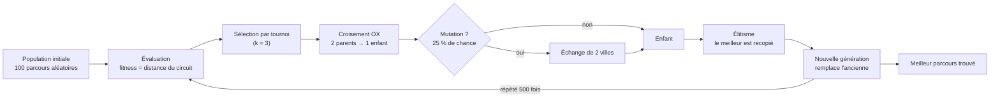

# Fiche de révision — L'algorithme génétique du projet « marchand ambulant »

> But de cette fiche : pouvoir répondre à **n'importe quelle question** (écrit ou oral) sur l'algorithme génétique en général **et** sur le code de `algo_genetique.py`.

---

## 0. Le pitch en 30 secondes (à savoir réciter)

> « Le problème du marchand ambulant est NP-difficile : avec 20 villes, il existe environ \(6 \times 10^{16}\) circuits distincts, donc on ne peut pas tous les essayer. L'algorithme génétique est une **métaheuristique** inspirée de l'évolution : on fait évoluer une **population de 100 parcours** pendant **500 générations**. À chaque génération, les meilleurs parcours sont **sélectionnés par tournoi**, **croisés** (Order Crossover) et parfois **mutés** (échange de 2 villes). Le meilleur est conservé (élitisme). On relance 5 fois et on garde le meilleur résultat. Sur notre graphe de 20 villes, on obtient ≈ **3330 km** contre **3446 km** pour Christofides. »

---

## 1. Vocabulaire indispensable

| Terme | Définition | Dans notre code |
|---|---|---|
| Algorithme génétique | Métaheuristique d'optimisation qui imite l'évolution naturelle | tout le fichier `algo_genetique.py` |
| Individu / chromosome | Une solution candidate | une **permutation** des indices des villes |
| Gène | Une unité du chromosome | **une ville** (un numéro de 0 à 19) |
| Population | L'ensemble des individus d'une génération | 100 parcours |
| Génération | Un cycle complet d'évolution | 500 générations |
| Fitness | Valeur qui note un individu | **distance totale du circuit fermé** (en km) — à **minimiser** |
| Sélection | Choisir quels individus deviennent parents | tournoi de 3 individus |
| Croisement (crossover) | Mélanger 2 parents pour créer un enfant | Order Crossover (OX) |
| Mutation | Perturber légèrement un enfant | échange de 2 villes (swap) |
| Élitisme | Conserver le meilleur individu tel quel | 1re place de chaque nouvelle génération |
| Convergence | Moment où la population n'évolue plus | observée dès ~100 générations |

⚠️ **Piège de vocabulaire** : dans la littérature, la « fitness » est une qualité qu'on **maximise**. Dans notre code, le mot *fitness* désigne en fait un **coût** (une distance) qu'on **minimise** (`min(...)` partout). Dire : « c'est une fonction de coût, minimisée ».

---

## 2. Comment fonctionne un algorithme génétique (le cycle)

**Les 3 ingrédients à retenir et leurs rôles :**

1. **Sélection** = pression (garder les bons) → *exploitation*.
2. **Croisement** = recombinaison (mélanger les bons) → *exploration guidée*.
3. **Mutation** = hasard (introduire du nouveau) → *exploration* + **anti-optimum local**.

Sans une de ces trois briques, l'algorithme stagne : sans sélection on cherche au hasard ; sans croisement on ne combine pas les bonnes idées ; sans mutation la population devient identique et se bloque.

---

## 3. Le problème : le marchand ambulant (TSP)

- On cherche un **cycle hamiltonien** de poids minimum : passer une fois par chaque ville et revenir au départ (le marchand Théobald).
- **NP-difficile** : le nombre de circuits explose (20! ≈ 2,43 × 10¹⁸ ordres, ≈ 6,1 × 10¹⁶ circuits distincts car le point de départ et le sens ne comptent pas).
- Les algorithmes **exacts** deviennent inutilisables ; on utilise des **heuristiques / approximations** :
  - **Christofides** (`algo_christofides*.py`) : déterministe, **garanti ≤ 1,5 × optimum**.
  - **Algorithme génétique** (`algo_genetique.py`) : **stochastique, sans garantie**, mais souvent meilleur en pratique.
- Les distances sont calculées par la **formule de Haversine** (km réels) dans `map.py`, pas des distances euclidiennes : car ce sont des coordonnées GPS (latitude/longitude).

---

## 4. Ton code, fonction par fonction (à connaître par cœur)

Le fichier est organisé en **8 sections numérotées**. Voici ce que fait chacune et *pourquoi*.

### Section 1 — Données : `VILLES`, `N`, `DISTANCES`
- `from map import G` récupère le graphe **complet** construit depuis le CSV (20 villes, arêtes pondérées en km).
- `VILLES = list(G.nodes)` : la liste des noms, **indexée** (Paris = 0, etc.). `N = 20`.
- `DISTANCES` : matrice 20×20 où `DISTANCES[i][j]` = distance entre la ville *i* et la ville *j*, lue directement dans les poids d'arêtes (Haversine).
- **Détail important** : la **diagonale vaut 0** (distance d'une ville à elle-même). Le graphe n'a pas d'arête d'une ville vers elle-même (`G[v][v]` provoque une erreur `KeyError`) — c'est un bug qu'on a rencontré et corrigé.
- *Pourquoi des indices et pas des noms ?* Plus rapide et plus simple à manipuler dans l'algorithme ; on retraduit en noms à la fin.

### Section 2 — `fitness(tour, distances)`
- Calcule la **distance totale du circuit fermé** : pour chaque ville, on ajoute la distance vers la suivante, et grâce au **modulo** `(i + 1) % n`, la **dernière ville revient vers la première**.
- *Pourquoi fermer ?* Le marchand doit rentrer chez lui. Et c'est indispensable pour être **comparable** à Christofides, qui mesure lui aussi un circuit fermé. (La toute première version mesurait un chemin *ouvert* : la distance affichée était donc fausse, sous-estimée.)
- C'est la **fonction de coût** : plus la valeur est petite, meilleur est le parcours.

### Section 3 — `selection(population, distances, k=3)` (tournoi)
- On tire **3 individus au hasard** (`random.sample`) et on garde **le plus court** (`min` sur la fitness).
- *Pourquoi le hasard ?* Pour ne pas toujours choisir les 2-3 mêmes individus : cela **garde de la diversité** et évite une convergence prématurée.
- *Effet de k* : k grand → pression forte (rapide mais risque de blocage), k petit → plus exploratoire. **k = 3** est un compromis doux classique.

### Section 4 — `croisement_ox(parent1, parent2)` (Order Crossover)
Les 3 étapes :
1. On tire **2 points de coupe** au hasard.
2. L'enfant **copie le segment central du parent 1** (positions `[debut:fin]`).
3. On complète les positions restantes avec les villes du **parent 2 dans leur ordre d'apparition**, en **ignorant celles déjà copiées**.

*Exemple (villes A à F)* : parent1 = `A C B E D F`, coupe entre les positions 1 et 4 → l'enfant **copie le segment `C B E`** (positions 1 à 3). Parent2 = `D F A E C B` ; ses villes pas encore présentes, dans l'ordre, sont `D F A`. On place `D` **avant** le segment et `F A` **après** → enfant = `D C B E F A`. ✅ Chaque ville apparaît **une seule fois**.

- *Pourquoi l'enfant est-il toujours valide ?* Le segment contient des villes **uniques**, et la liste des « restantes » contient exactement toutes les autres villes, **chacune une fois** ; elle remplit exactement le bon nombre de positions libres. Donc c'est toujours une permutation.
- *Pourquoi OX plutôt qu'un croisement classique à 1 point ?* Un croisement naïf **dupliquerait ou ferait disparaître** des villes (interdit au TSP !). L'OX **préserve des sous-itinéraires entiers** (le segment) : c'est le croisement de référence pour les problèmes de type « ordre ».

### Section 5 — `mutation(tour)` (échange, « swap »)
- On tire **2 positions** au hasard et on **échange** les villes correspondantes.
- *Rôle* : introduire des solutions que le croisement ne peut pas produire seul, et surtout **aider à sortir des optimums locaux**. Sans mutation, la population finit par devenir identique et ne progresse plus.
- *Alternative classique* : la **mutation par inversion** (retourner tout un segment de parcours). Testée ici : elle atteint le même meilleur résultat. Le swap reste plus simple à expliquer.

### Section 6 — `algorithme_genetique(pop_size=100, generations=500, taux_mutation=0.25)`
C'est la boucle d'évolution :
1. **Population initiale** : 100 parcours aléatoires — `random.sample(range(N), N)` garantit une **permutation sans doublon**.
2. Pour chaque génération :
   - **Élitisme** : on recopie tel quel le meilleur individu de la génération courante (1re place de la nouvelle population).
   - On crée **99 enfants** : 2 parents par **tournoi**, **croisement OX**, **mutation avec 25 % de chance**.
   - **Remplacement générationnel** : la nouvelle population remplace entièrement l'ancienne.
   - **Affichage tous les 250 générations** de la meilleure distance (pour voir la convergence).
3. On renvoie `population[0]` : le meilleur de la dernière génération (déjà garanti par l'élitisme).

- *Pourquoi l'élitisme a-t-il été ajouté ?* Dans la version d'origine il n'y en avait pas : le meilleur individu pouvait être **perdu** d'une génération à l'autre, et on ne gardait que le meilleur de la **dernière** génération (le tout premier essai donnait ainsi 4229 km). Avec l'élitisme, le résultat ne peut plus régresser.
- *Pourquoi 25 % de mutation ?* Testé : à 5 %, la population perd sa diversité trop vite et se bloque vers **3400–4200 km**. À 25 %, on descend vers **3157–3350 km**.
- *Pourquoi un `while` pour les enfants ?* Parce que l'élite occupe déjà 1 place : il ne faut créer que `pop_size − 1` enfants.

### Section 7 — `main()`
- **5 essais successifs** : l'algorithme est aléatoire, deux lancements donnent deux résultats différents. On garde le **meilleur des 5** (astuce simple de « multi-start », ~6 s au total).
- Affiche chaque essai et le meilleur courant, puis convertit les **indices → noms de villes** (`[VILLES[i] for i in meilleur]`).
- Affiche l'itinéraire complet (« Paris -> Le Havre -> ... -> Paris ») et la **distance totale en km**.
- `random.seed(42)` (commenté) permet de **rejouer exactement le même résultat**.

### Section 8 — `afficher_parcours(tour, villes, distance)`
- Ferme la boucle (retour à la ville de départ), puis dessine :
  - le **fond de carte** (graphe complet gris, villes en bleu) comme dans les scripts Christofides ;
  - l'**itinéraire en rouge** par-dessus ;
  - le titre avec la distance.

---

## 5. Les paramètres et leurs effets (tableau à retenir)

| Paramètre | Valeur | Rôle | Si on l'augmente | Si on le diminue |
|---|---|---|---|---|
| `pop_size` | 100 | diversité génétique | plus robuste, plus lent | converge vite, résultats moins bons |
| `generations` | 500 | durée de l'évolution | inutile ici : convergence vers la génération ~100 | risque de s'arrêter trop tôt |
| `taux_mutation` | 0,25 | dose d'exploration | trop haut = recherche aléatoire | trop bas = blocage (vérifié à 5 %) |
| `k` (tournoi) | 3 | pression sélective | sélection plus dure, diversité ↓ | sélection plus molle, convergence lente |
| `NOMBRE_ESSAIS` | 5 | corrige l'aléa | résultat plus stable | variance plus forte |
| `random.seed` | commenté | reproductibilité | — | — |

---

## 6. Résultats mesurés et comparaison

| Méthode | Distance | Commentaire |
|---|---|---|
| Christofides (networkx) | **3445,60 km** | rapide, déterministe, garanti ≤ 1,5 × optimum |
| Algo génétique (5 essais) | **≈ 3334 km** | testé le 14/09 : meilleur des 5 essais = 3334,20 km |
| Meilleur jamais observé (graines 0, 2, 4) | **3157,12 km** | certains lancements trouvent encore mieux |
| Un essai isolé | entre ≈ 3157 et ≈ 4000 km | montre la **variance** de l'aléatoire |

- Le parcours à 3334 km a été **vérifié en 2-opt** : aucun échange de segments ne l'améliore → c'est un **optimum local « fort »**.
- **Encadrement de l'optimum** (bonus à l'oral) : on sait que `optimum ≤ 3157,12 km` (meilleure solution trouvée) et, grâce à la garantie de Christofides, `optimum ≥ 3445,60 / 1,5 ≈ 2297 km`.
- **Conclusion honnête** : le génétique **bat Christofides ici** (3334 < 3446), mais il n'offre **aucune garantie** et son résultat **varie** à chaque lancement.

---

## 7. Coût de calcul (si on te pose la question)

- Évaluations de fitness par génération ≈ élite (100) + 99 enfants × (2 tournois × 3 candidats) ≈ **700**.
- Donc ≈ **350 000 évaluations** par essai (× 5 essais ≈ 1,7 million).
- Complexité : **O(générations × population × k × n)** ; une évaluation de fitness est en **O(n)**.
- Temps réel mesuré : **≈ 1,3 s par essai**, ≈ 6,5 s pour les 5 essais. → bien plus rapide que l'énumération exhaustive, impossible.

---

## 8. 25 questions / réponses prêtes pour l'oral

**Concepts**

1. *Qu'est-ce qu'un algorithme génétique ?* → Une métaheuristique d'optimisation qui simule l'évolution : une population de solutions évolue par sélection, croisement et mutation.
2. *Pourquoi adapté au TSP ?* → TSP NP-difficile ; le GA explore intelligemment sans énumérer les ≈ 6 × 10¹⁶ circuits.
3. *Comment représentez-vous une solution ?* → Par une permutation d'indices de villes : l'ordre de visite. Chaque ville (gène) apparaît exactement une fois.
4. *La fitness est-elle à maximiser ?* → Non : c'est un **coût** (distance) qu'on **minimise** ; on garde toujours le plus petit.
5. *Qu'est-ce qu'un optimum local ?* → Une solution qu'aucune petite modification n'améliore, mais qui n'est pas la meilleure globale. Le GA peut s'y bloquer : c'est pour ça qu'on mute et qu'on relance 5 fois.

**Sélection**

6. *Comment sélectionnez-vous les parents ?* → Tournoi : 3 individus au hasard, on garde le plus court.
7. *Pourquoi ne pas prendre systématiquement les 2 meilleurs ?* → La population perdrait sa diversité et convergerait vers un optimum local médiocre.
8. *Que change k ?* → k élevé = pression forte ; k = 3 = compromis, sélection douce qui garde de la diversité.

**Croisement**

9. *Expliquez OX.* → 2 points de coupe, l'enfant copie le segment central du parent 1, puis on complète avec l'ordre du parent 2 en sautant les villes déjà présentes.
10. *Pourquoi pas un croisement à 1 point simple ?* → Il créerait des doublons et des villes manquantes — interdit ici. OX garantit une permutation valide.
11. *Pourquoi OX est-il particulièrement adapté ?* → Il transmet des **sous-itinéraires entiers** (segments de trajet) d'un parent à l'enfant : exactement ce qui fait la qualité d'une tournée.
12. *L'enfant est-il toujours valide ?* → Oui : segment unique + liste filtrée du parent 2 remplit exactement les positions restantes. Toujours une permutation.

**Mutation**

13. *À quoi sert la mutation ?* → Introduire des arrangements nouveaux, éviter que toute la population devienne identique et sortir des optimums locaux.
14. *Que se passe-t-il si on la supprime ?* → La population converge puis **stagne** : le croisement seul ne crée pas assez de nouveauté.
15. *Pourquoi 25 % et pas 5 % ?* → Comparaison faite : à 5 % blocage vers 3400–4200 km ; à 25 % on atteint 3157–3350 km. La sélection est déjà très sélective (tournoi + élitisme), il faut donc une mutation forte pour compenser.
16. *Une autre mutation possible ?* → L'**inversion** (retourner un segment) : plus adaptée au TSP, testée, même meilleur résultat trouvé.

**Boucle / paramètres**

17. *Qu'est-ce que l'élitisme ? Pourquoi l'avoir ajouté ?* → Recopier le meilleur individu à chaque génération. Sans lui, le meilleur peut disparaître et le résultat final était moins bon (4229 km lors du premier test).
18. *Générationnel ou steady-state ?* → Générationnel : toute la population est remplacée (sauf l'élite).
19. *Pourquoi 500 générations ?* → Marge confortable : en pratique la population converge dès ~100 générations.
20. *Pourquoi 5 essais ?* → L'algorithme est stochastique : multiplier les essais et garder le meilleur stabilise et améliore le résultat (simple multi-start).

**Comparaison / garanties**

21. *Le GA donne-t-il l'optimum ?* → Non, **aucune garantie**. On peut seulement encadrer : optimum ≤ 3157 km (trouvé) et ≥ ≈ 2297 km (garantie Christofides).
22. *Différence avec Christofides ?* → Christofides est déterministe et garanti ≤ 1,5 × optimum ; le GA est aléatoire, sans garantie, mais ici **il fait mieux** (3334 < 3446 km).
23. *Pourquoi votre distance est-elle comparable à Christofides ?* → Même graphe (via `map.py`), mêmes distances Haversine en km, et **circuit fermé dans les deux cas**.
24. *Pourquoi le résultat change-t-il à chaque lancement ?* → Tirages aléatoires : population initiale, tournois, points de coupe, mutations. `random.seed(42)` fige tout.
25. *Comment améliorer encore ?* → Hybrider avec du 2-opt (recherche locale), mutation par inversion, plus d'essais, immigrants aléatoires, ou critère d'arrêt quand la population stagne.

---

## 9. Pièges et erreurs (à connaître pour ne pas se faire avoir)

- ❌ « Le génétique trouve toujours la meilleure solution » → faux : pas de garantie, résultat variable.
- ❌ « La fitness, on la maximise » → dans ce code, on **minimise** une distance.
- ❌ « Un croisement quelconque suffit » → non : il faut OX (ou équivalent) pour garder une permutation valide.
- ❌ « La mutation doit être très rare » → dépend : ici 5 % était trop faible (blocage vérifié).
- ❌ « 20 villes, c'est facile, on pourrait tout essayer » → 20! ≈ 2,43 × 10¹⁸ ordres : impossible.
- ❌ « Le GA remplace Christofides » → non : les deux se **comparent** ; Christofides apporte la garantie théorique.
- Bug réel rencontré : `G['Paris']['Paris']` → `KeyError` car le graphe n'a pas de boucle ; corrigé par une **diagonale à 0** dans la matrice des distances.
- Bug de la version d'origine : fitness sur un **chemin ouvert** alors que le dessin fermait le circuit → distance affichée sous-estimée. Corrigé par le modulo.
- Point de vigilance : `random.sample(population, k)` exige `k ≤ taille de la population` (toujours vrai ici : k = 3, population = 100).

---

## 10. Les phrases « qui font mouche » en conclusion

- « Le génétique est une méthode à **double tranchant** : excellente qualité pratique, mais **aléatoire et sans garantie** — c'est exactement le contraire de Christofides, déterministe et garanti à 1,5 × l'optimum. »
- « Nos expériences le montrent : un seul essai peut donner 4000 km, le meilleur de 5 donne ~3330 km, et certains tirages descendent à 3157 km. La qualité vient de la **diversité**, pas de la chance. »
- « L'élitisme et la mutation forte sont les deux réglages qui ont transformé un algorithme qui stagnait à 4229 km en un algorithme qui bat Christofides. »

---

## 11. Mini-boussole : où trouver quoi dans le projet

| Question | Fichier / élément |
|---|---|
| D'où viennent les villes et les distances ? | `villes_france_lat_long.csv` + `map.py` (Haversine, graphe complet) |
| La solution « garantie » | `algo_christofides.py` (implémentée à la main) et `algo_christofides_networkx.py` |
| La solution « évolutionniste » | `algo_genetique.py` (sections 1 → 8) |
| Le contexte théorique | `theorie_des_graphes.md` |
| Les paramètres à modifier pour tester | `main()` dans `algo_genetique.py` (`pop_size`, `generations`, `taux_mutation`, `NOMBRE_ESSAIS`, `random.seed`) |
