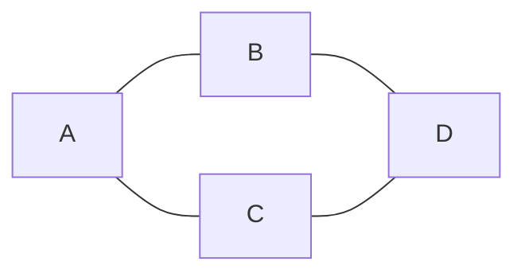
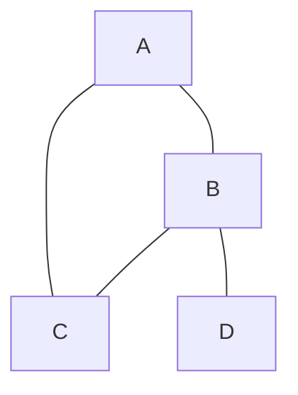
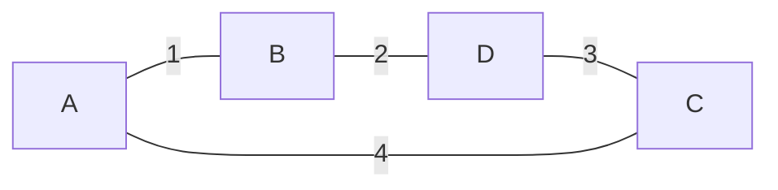
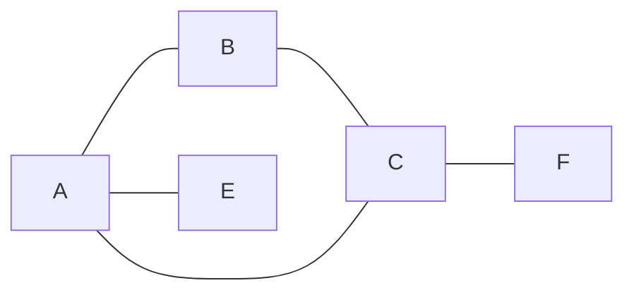
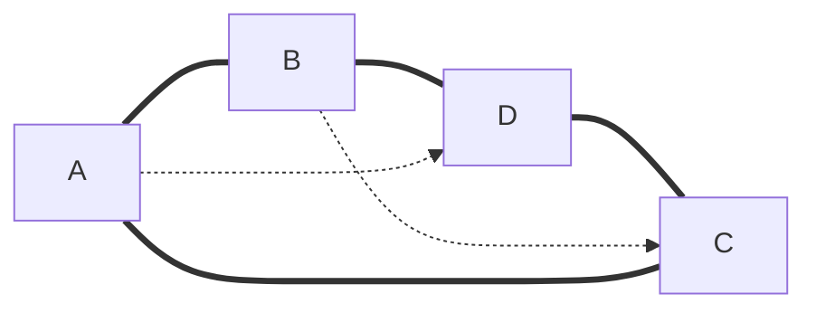
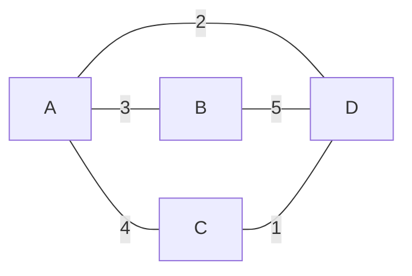
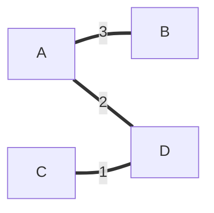
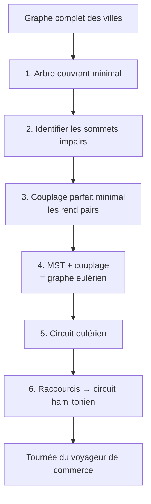
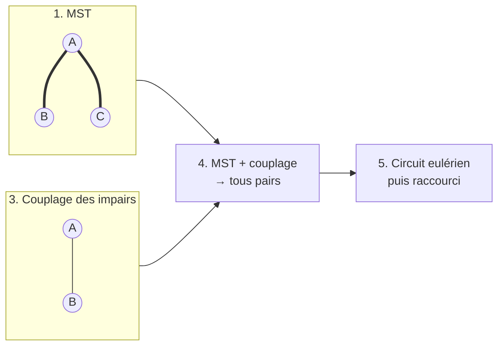
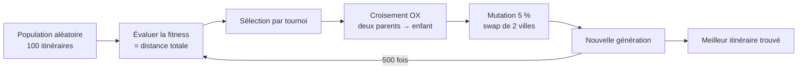

# Théorie des graphes & algorithmes — Fiche de révision « Le marchand ambulant »

Ce document regroupe toutes les notions nécessaires au projet : le **problème du
voyageur de commerce** (TSP) et ses deux approches de résolution — l'**algorithme
de Christofides** et l'**algorithme génétique**.

## Sommaire

1. Le problème du voyageur de commerce (TSP)
2. Degré d'un sommet : pair ou impair
3. Circuit eulérien
4. Circuit hamiltonien
5. MST — arbre couvrant de poids minimal
6. Lien avec l'algorithme de Christofides
7. L'algorithme de Christofides — en détail
8. L'algorithme génétique
9. Christofides vs génétique : quelles différences ?
10. Où chercher dans le code
11. Mémo de dernière minute

---

## 1. Le problème du voyageur de commerce (TSP)

Un marchand (**Théobald**) doit visiter **n villes**, chacune **exactement une
fois**, puis revenir à son point de départ, en minimisant la **distance totale
parcourue**.

En langage graphes : les villes sont les **sommets**, les distances (à vol
d'oiseau, formule de **Haversine**) sont les **arêtes pondérées**, et on cherche
le **circuit hamiltonien de poids minimal**.

### Pourquoi c'est difficile

- Il y a `(n - 1)! / 2` itinéraires possibles : pour 19 villes, environ
  `3 × 10¹⁵` (3 millions de milliards).
- Le problème est **NP-complet** : aucun algorithme connu ne trouve la solution
  exacte en temps raisonnable quand le nombre de villes augmente.

### Les deux stratégies du projet

1. **Christofides** — algorithme d'approximation : construire une solution
   **garantie au pire 1,5 fois l'optimal**, en temps polynomial.
2. **Algorithme génétique** — métaheuristique : faire « évoluer » une population
   d'itinéraires vers une très bonne solution, **sans garantie**.

> **TSP** = *Traveling Salesman Problem* = problème du voyageur de commerce.

---

## 2. Degré d'un sommet : pair ou impair

Dans un graphe, chaque **sommet** (nœud) possède un **degré** : c'est le nombre
d'arêtes qui y sont reliées.



- Sommet `B` : relié à `A` et `D` → degré 2 (**pair**)
- Sommet `A` : relié à `B` et `C` → degré 2 (**pair**)

Ici, **tous les sommets sont de degré 2 (pairs)**.

Autre exemple avec un sommet de degré impair :



- `D` : relié à un seul sommet → degré 1 (**impair**)

Ici, `D` est de degré 1 (impair), tandis que `A`, `B`, `C` ont des degrés pairs.

---

## 3. Circuit eulérien

Un **circuit eulérien** est un chemin qui **passe par chaque arête exactement une
fois** et revient à son point de départ.

C'est le célèbre problème des **ponts de Königsberg** : traverser chaque pont une
seule fois et revenir au départ.

### Exemple visuel

Un circuit eulérien traverse chaque **arête** une seule fois. Ici, tous les sommets
sont de degré pair, donc le circuit est possible (on « fait le tour » du carré) :



En suivant l'ordre `A → B → D → C → A`, chaque arête est traversée exactement une fois
et on revient au point de départ. Ce graphe a donc un **circuit eulérien**.

À l'inverse, ce graphe avec deux sommets impairs (`E` et `F` de degré 1) n'en a pas :



### Théorème d'Euler (1736)

Un graphe possède un circuit eulérien **si et seulement si** :

> **Tous les sommets ont un degré pair** et le graphe est connexe.

**Logique** : pour entrer puis ressortir d'un sommet à chaque passage, il faut un
nombre pair d'arêtes (une pour entrer, une pour sortir). Un sommet de degré impair
rend le circuit impossible.

> **Circuit eulérien = traverse toutes les ARÊTES une seule fois.**
> Condition → tous les sommets sont de degré **pair**.

---

## 4. Circuit hamiltonien

Un **circuit hamiltonien** est un chemin qui **passe par chaque sommet exactement
une fois** et revient à son point de départ.

C'est exactement le problème du **voyageur de commerce** : visiter chaque ville une
seule fois, sans jamais y repasser.

### Exemple visuel

Un circuit hamiltonien traverse chaque **sommet** une seule fois. Ici, on suit le
cycle `A → B → D → C → A` (arêtes en gras), chaque sommet étant visité une seule fois :



Les arêtes en pointillés (`A-D` et `B-C`) ne sont **pas** utilisées : on ne les
traverse pas pour visiter chaque sommet une seule fois.

**Différence clé** : contrairement au circuit eulérien, il n'existe **pas de
condition simple** pour savoir si un graphe contient un circuit hamiltonien.
Trouver le circuit hamiltonien le plus court est un problème **NP-complet**
(très difficile pour de grands graphes).

> **Circuit hamiltonien = traverse tous les SOMMETS une seule fois.**
> C'est le problème du TSP (Traveling Salesman Problem).

---

## Tableau récapitulatif

| Notion               | Traverse quoi ?              | Difficulté                        |
|----------------------|------------------------------|-----------------------------------|
| Circuit **eulérien**   | toutes les **arêtes** une fois   | Facile : tous sommets pairs        |
| Circuit **hamiltonien**| tous les **sommets** une fois    | Difficile : NP-complet             |

---

## 5. MST — Arbre couvrant de poids minimal

**MST** signifie **Minimum Spanning Tree** (arbre couvrant de poids minimal).

### Décomposition du terme

- **Arbre** : graphe connexe sans cycle.
- **Couvrant (Spanning)** : il couvre **tous les sommets** du graphe.
- **De poids minimal (Minimum)** : parmi tous les arbres couvrants, c'est celui dont
  la **somme des poids des arêtes** est la plus petite.

> Le MST relie toutes les villes entre elles avec le **coût total le plus bas
> possible**, sans jamais former de cycle. Il faut `n - 1` arêtes pour relier
> `n` sommets.

### Exemple

Le graphe complet avec les poids (distances) :



Parmi tous les arbres couvrants possibles, le **MST** garde les arêtes les plus
économiques sans créer de cycle. Ici le MST sélectionne `A-D (2)`, `C-D (1)` et
`A-B (3)` pour un total de **6** :



Les arêtes `A-C (4)` et `B-D (5)` sont écartées car elles coûtent plus cher et
créeraient un cycle. Le MST relie bien les 4 sommets avec 3 arêtes
(`n - 1 = 3` pour `n = 4` sommets).

Plusieurs arbres couvrants possibles, le MST est celui qui minimise le total des poids.

### Algorithmes classiques

- **Prim** : partir d'un sommet, ajouter à chaque étape l'arête la moins chère qui
  relie un sommet déjà dans l'arbre à un sommet hors de l'arbre.
- **Kruskal** : trier toutes les arêtes par poids croissant, ajouter une arête si
  elle ne crée pas de cycle.

Dans NetworkX : `nx.minimum_spanning_tree(G)`.

### Pourquoi dans Christofides ?

Le MST est le **squelette de départ** de l'algorithme :

1. Il garantit que toutes les villes sont **reliées** de façon connexe.
2. Son coût est **inférieur ou égal** à la tournée optimale : en retirant une
   arête de la tournée optimale, on obtient un arbre couvrant — forcément plus
   cher ou égal au MST. C'est ce point qui permet de prouver la borne des 1,5
   (voir la preuve en section 7).

### Schéma global du pipeline



---

## 6. Lien avec l'algorithme de Christofides

Christofides cherche un **circuit hamiltonien** (tournée du voyageur de commerce),
mais utilise un **circuit eulérien** comme intermédiaire :

1. **Arbre couvrant minimal (MST)** : relie toutes les villes avec le moins d'arêtes possible.
2. **Sommets impairs du MST** : repérer les sommets de degré impair.
3. **Couplage parfait minimal** : relier ces sommets impairs entre eux pour les rendre
   **pairs**, en ajoutant le minimum d'arêtes.
4. **Graphe eulérien** : MST + couplage → tous les sommets sont **pairs** → on peut
   tracer un **circuit eulérien** (chaque arête une fois).
5. **Raccourcis** : suivre ce circuit eulérien en « sautant » les villes déjà
   visitées → obtenir un **circuit hamiltonien** (visiter chaque ville une fois).

> La propriété « tous sommets pairs → circuit eulérien » est l'astuce qui permet de
> construire une tournée presque optimale en temps polynomial, avec la garantie d'être
> au pire **1,5 fois** le chemin optimal.

---

## 7. L'algorithme de Christofides — en détail

Christofides (1976) est un algorithme d'**approximation** pour le problème du
voyageur de commerce **métrique** (où les distances vérifient l'inégalité
triangulaire : `d(A,C) ≤ d(A,B) + d(B,C)`). Il produit une tournée **presque
optimale** en temps polynomial, avec la garantie : au pire **1,5 fois** la solution
optimale.

### Les 5 étapes

1. **Construire un arbre couvrant minimal (MST)** du graphe complet des villes.
2. **Trouver les sommets de degré impair** dans le MST.
3. **Trouver un appariement (couplage) parfait de poids minimal** entre ces sommets impairs.
4. **Ajouter les arêtes du couplage au MST** : on obtient un **multigraphe** dont
   tous les sommets sont de degré **pair**.
5. **Trouver un circuit eulérien** dans ce multigraphe, puis le **raccourcir**
   (sauter les sommets déjà visités) pour obtenir un **circuit hamiltonien**.

### Pseudo-code

```text
christofides(G):
    T  ← arbre_couvrant_minimal(G)          # 1. MST
    O  ← sommets_de_degre_impair(T)          # 2. sommets impairs
    M  ← couplage_parfait_minimal(G, O)      # 3. couplage minimal
    H  ← T ∪ M                               # 4. multigraphe eulérien
    C  ← circuit_eulerien(H)                 # 5. circuit eulérien
    retourne raccourcir(C)                   #    → circuit hamiltonien
```

### Schéma illustré



### Le point subtil : le couplage parfait minimal

Dans un arbre, le nombre de sommets de degré impair est **toujours pair** (c'est un
résultat classique : la somme des degrés vaut `2 × nombre d'arêtes`, donc pair). On
peut donc toujours les apparier deux à deux.

Le **couplage parfait minimal** relie ces sommets impairs entre eux, en minimisant la
distance totale ajoutée, de sorte que chaque sommet impair reçoive exactement une
arête supplémentaire et devienne **pair**. C'est l'étape la plus coûteuse de
l'algorithme, mais elle garantit la borne de 1,5.

### Exemple complet sur 4 villes

Distances : `A-B = 2`, `A-C = 3`, `A-D = 4`, `B-C = 3`, `B-D = 5`, `C-D = 1`.

1. **MST** (Kruskal : arêtes les moins chères, sans cycle) : `C-D (1)`, `A-B (2)`,
   `A-C (3)` → coût total **6**.
2. **Degrés** : `A = 2`, `B = 1`, `C = 2`, `D = 1` → sommets impairs : `B`, `D`.
3. **Couplage minimal** sur `{B, D}` : une seule option → arête `B-D (5)`.
4. **MST + couplage** : tous les degrés deviennent pairs (2, 2, 2, 2) → le
   graphe est eulérien.
5. **Circuit eulérien** : `B → A → C → D → B` (chacune des 4 arêtes, une seule
   fois). Chaque ville n'y apparaît qu'une fois → il est déjà hamiltonien.
   Tournée obtenue : `2 + 3 + 1 + 5 = 11`.

Vérification : l'optimal est `A → B → C → D → A = 2 + 3 + 1 + 4 = 10`.
Christofides donne **11 ≤ 1,5 × 10 = 15** ✓ — proche de l'optimal, mais pas
forcément optimal : c'est le prix de la rapidité.

### Pourquoi la borne de 1,5 ? (preuve simplifiée)

- **MST ≤ OPT** : la tournée optimale, moins une arête, forme un arbre couvrant
  (voir section 5) → `coût(MST) ≤ OPT`.
- **Couplage ≤ OPT / 2** : les sommets impairs du MST sont en nombre **pair**
  (lemme des poignées de main). Reliés dans l'ordre où la tournée optimale les
  visite, ils forment — grâce à l'inégalité triangulaire — un cycle de coût
  ≤ OPT. En prenant une arête sur deux, ce cycle se décompose en **deux
  couplages parfaits** dont le moins cher coûte ≤ OPT / 2. Notre couplage étant
  **minimal**, il coûte ≤ OPT / 2.
- **Total** : le circuit eulérien coûte `MST + couplage ≤ OPT + OPT/2 = 1,5 × OPT`.
- **Raccourcis** : grâce à l'inégalité triangulaire, sauter une ville déjà
  visitée ne rallonge **jamais** le trajet → tournée finale ≤ 1,5 × OPT. ∎

### Complexité et comportement

- **Polynomial** (l'étape la plus coûteuse est le couplage, ≈ O(n³)) : utilisable
  avec des centaines de villes.
- **Déterministe** : même graphe → même tournée, résultat reproductible.
- En pratique, souvent à **moins de 10 %** de l'optimal — bien mieux que la
  garantie théorique de 50 %.

### Pourquoi cet algorithme est pertinent ici

- Le problème du voyageur de commerce est **NP-complet** : trouver la solution exacte
  est infaisable pour de nombreuses villes (complexité factorielle `n!`).
- Christofides fournit une **solution presque optimale en temps polynomial**, c'est
  un excellent compromis **qualité / rapidité** pour un grand nombre de villes.
- La borne **1,5 × optimal** est une **garantie prouvée** : la tournée ne sera jamais
  plus de 50 % plus longue que la solution optimale — et en pratique, elle est souvent
  bien meilleure que cette borne.

## 8. L'algorithme génétique — la sélection naturelle appliquée au TSP

### L'idée

Au lieu de construire intelligemment une solution (Christofides), on **imite
l'évolution biologique** : une population d'itinéraires « vit », se reproduit
et mute ; les moins bons disparaissent. Génération après génération, les
itinéraires s'améliorent.

C'est une **métaheuristique** : une méthode générale de recherche d'une bonne
solution, **sans garantie mathématique** sur le résultat.

### Le vocabulaire, transposé au TSP

| Terme biologique | Dans le projet | Concrètement |
|---|---|---|
| **Individu** | un itinéraire | un ordre de visite, ex. `[Paris, Lyon, Nice, …]` |
| **Gène** | une ville | la position d'une ville dans l'itinéraire |
| **Population** | 100 individus | `pop_size = 100` |
| **Fitness** | distance totale | plus elle est **petite**, meilleur est l'individu |
| **Génération** | une itération | `generations = 500` |
| **Croisement** | reproduction | mélange de deux parents → un enfant |
| **Mutation** | diversité | échange de deux villes au hasard |

### Les 3 opérateurs

**1. Sélection par tournoi** — on tire `k = 3` individus au hasard ; celui de
meilleure fitness (distance minimale) gagne et devient parent. Les bons
itinéraires sont choisis plus souvent, sans éliminer totalement les autres
(la diversité est conservée).

**2. Croisement OX (Order Crossover)** — on copie un **morceau continu** du
parent 1 dans l'enfant, puis on complète les trous avec les villes du parent 2,
**dans leur ordre d'apparition**, en sautant celles déjà copiées. L'enfant est
donc une **permutation valide** : chaque ville apparaît exactement une fois.

```text
Parent 1 : A B C D E F    (morceau copié : C D E)
Parent 2 : D F A E B C
Enfant   : F A C D E B    (trous remplis par F, A, B — ordre du parent 2)
```

**3. Mutation par échange (swap)** — avec une probabilité de **5 %**, on
échange deux villes au hasard dans l'enfant. Rôle : explorer de nouvelles
solutions et éviter la **convergence prématurée** (toute la population
devient identique et se coince dans un optimum local).

### Pseudo-code

```text
algorithme_genetique(villes, pop_size, generations):
    pop ← pop_size itinéraires aléatoires
    répéter generations fois :
        new_pop ← vide
        répéter pop_size fois :
            p1 ← tournoi(pop)               # sélection
            p2 ← tournoi(pop)               # sélection
            enfant ← croisement_OX(p1, p2)  # reproduction
            si aléa < 5 % : enfant ← mutation_swap(enfant)
            new_pop.ajouter(enfant)
        pop ← new_pop
    retourner l'individu de fitness minimale
```

### Schéma de la boucle



### Les paramètres qui comptent

- **`pop_size = 100`** : trop petit → manque de diversité ; trop grand → lent.
- **`generations = 500`** : plus de générations → meilleure solution, mais
  temps de calcul proportionnel.
- **Taux de mutation = 5 %** : trop haut → recherche au hasard ; trop bas →
  optimum local.

### Forces et faiblesses

**Points forts**

- Très **flexible** : aucune hypothèse sur les distances, adaptable à presque
  tout problème d'optimisation.
- **Simple** à implémenter (trois opérateurs).
- Donne souvent d'**excellentes solutions** en pratique.

**Points faibles**

- **Aucune garantie** de qualité (rien d'équivalent à la borne 1,5 de
  Christofides).
- Résultat **aléatoire** : différent à chaque exécution.
- **Paramètres sensibles** (population, générations, mutation) à régler à la main.
- Peut rester coincé dans un **optimum local**.

> Amélioration classique : l'**élitisme** — recopier tel quel le meilleur
> individu dans la génération suivante, pour ne jamais régresser.

---

## 9. Christofides vs génétique : quelles différences ?

| Critère | Christofides | Algorithme génétique |
|---|---|---|
| Famille | Algorithme d'approximation | Métaheuristique évolutionnaire |
| Garantie de qualité | **≤ 1,5 × l'optimal** (prouvée) | Aucune |
| Résultat | Déterministe, reproductible | Aléatoire, varie à chaque exécution |
| Hypothèses | Distances métriques (inégalité triangulaire) | Aucune |
| Vitesse | Polynomiale (≈ O(n³)) | Dépend de `pop_size × generations` |
| Qualité en pratique | Souvent < 10 % au-dessus de l'optimal | Très bonne, si bien réglé |
| Mise en œuvre | 5 étapes, couplage délicat | 3 opérateurs simples |

**En une phrase** : Christofides promet « au pire 50 % de trop, c'est prouvé » ;
le génétique promet « rien… mais je m'en sors souvent très bien ».

---

## 10. Où chercher dans le code

Dans `algo_christofides.py`, ces étapes se traduisent par des fonctions NetworkX :

- `nx.minimum_spanning_tree(G)` → étape 1
- Parcours des nœuds et test de parité du degré (`% 2 == 1`) → étape 2
- `nx.algorithms.matching.min_weight_matching(...)` → étape 3
- `nx.MultiGraph` (union du MST + couplage) → étape 4
- `nx.eulerian_circuit(...)` → étape 5

Dans `algo_genetique.py`, les opérateurs correspondent aux fonctions du fichier :

- `fitness(tour, distances)` → évaluation (distance totale)
- `selection(pop, distances, k=3)` → sélection par tournoi
- `order_crossover(p1, p2)` → croisement OX
- `mutate(child)` → mutation par échange
- `genetic_algorithm(...)` → boucle principale sur les générations

> **Piège à connaître** : la `fitness` actuelle ne compte pas le **retour à la
> ville de départ** (le circuit n'est pas fermé). Pour comparer loyalement avec
> Christofides, il faut ajouter la distance « dernière ville → première ville ».

---

## 11. Mémo de dernière minute

- **TSP** : visiter chaque ville une fois, distance totale minimale →
  **NP-complet** (`(n - 1)! / 2` itinéraires possibles).
- **Degré** : nombre d'arêtes reliées à un sommet. Somme des degrés =
  `2 × nombre d'arêtes` (lemme des poignées de main) → le nombre de sommets
  **impairs est toujours pair**.
- **Circuit eulérien** : toutes les **arêtes** une fois → condition : tous les
  sommets **pairs** (théorème d'Euler, 1736).
- **Circuit hamiltonien** : tous les **sommets** une fois → c'est le TSP ;
  aucune condition simple, NP-complet.
- **MST** : relier toutes les villes au coût minimal, `n - 1` arêtes, sans
  cycle (Prim, Kruskal). Son coût est toujours ≤ celui de la tournée optimale.
- **Inégalité triangulaire** : `d(A,C) ≤ d(A,B) + d(B,C)` — vraie pour les
  distances Haversine ; c'est elle qui rend les raccourcis sûrs et la borne
  1,5 valide.
- **Christofides** : MST → sommets impairs → couplage minimal → circuit
  eulérien → raccourcis. Garantie **≤ 1,5 × optimal**, polynomial, déterministe.
- **Génétique** : population aléatoire → fitness (distance) → tournoi →
  croisement OX → mutation swap (5 %) → 500 générations. Flexible, mais
  **sans garantie** et non déterministe.
